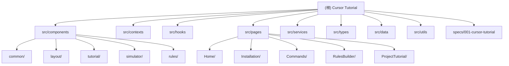

# CLAUDE.md - Cursor Tutorial Website

**Project**: Cursor Tutorial Website - 交互式 Cursor IDE 快速入门网站
**Branch**: 001-cursor-tutorial
**Last Updated**: 2026-02-13

---

## 变更记录 (Changelog)

### 2026-02-13 - 初始版本

- 创建项目 AI 上下文文档
- 完成全仓扫描和模块识别
- 建立根级 CLAUDE.md 和模块索引

---

## 项目愿景

创建一个交互式的 Cursor IDE 快速入门网站，帮助开发者通过可视化安装指南、模拟代码编辑器环境和项目式学习路径，快速掌握 Cursor 的核心功能。

### 核心功能

- 可视化安装指南（支持 Windows/macOS/Linux）
- 模拟代码编辑器环境，支持 Tab、Ctrl+K、Ctrl+L、@-mentions 等核心命令练习
- .cursorrules 文件生成器，通过表单引导用户创建个性化规则
- 项目式学习路径，通过微型项目整合所有学习内容

---

## 架构总览

### 技术栈

| 层级 | 技术 | 版本 |
|------|------|------|
| 框架 | React | 19.2.0 |
| 语言 | TypeScript | 5.9.3 |
| 构建工具 | Vite | 7.3.1 |
| 样式 | Tailwind CSS | 4.1.18 |
| 路由 | React Router DOM | 7.13.0 |
| 动画 | Framer Motion | 12.34.0 |
| 编辑器 | Monaco Editor (@monaco-editor/react) | 4.7.0 |
| 存储 | localStorage | - |
| 测试 | Vitest + React Testing Library | 3.2.4 |

### 架构原则

1. **React State**: 使用 Context API + hooks，不使用 Redux
2. **Desktop-First**: 最小视口 768px
3. **localStorage**: 所有持久化客户端完成
4. **China Red Theme**: 主色 #C41E3A，强调色 #FFD700
5. **Windows Dev**: PowerShell 兼容命令
6. **Simplicity**: 无不必要的抽象

### Windows 开发规范（重要）

> 当前项目仅在 **Windows 环境** 下开发，所有命令行操作必须符合 Windows/PowerShell 规范。

**禁止直接使用 Linux 命令**：
- ❌ `rm -rf` → ✅ `Remove-Item -Recurse -Force` 或 `rmdir /s`
- ❌ `cp -r` → ✅ `Copy-Item -Recurse`
- ❌ `mv` → ✅ `Move-Item`
- ❌ `cat` → ✅ `Get-Content`
- ❌ `ls -la` → ✅ `Get-ChildItem` 或 `dir`
- ❌ `touch` → ✅ `New-Item`
- ❌ `mkdir -p` → ✅ `New-Item -ItemType Directory -Force`
- ❌ `export VAR=value` → ✅ `$env:VAR = "value"`
- ❌ `echo $VAR` → ✅ `$env:VAR`
- ❌ `&&` 链式命令 → ✅ `;` 或分别执行
- ❌ `|` 管道 → ✅ PowerShell 管道（通常兼容）
- ❌ `>` 重定向 → ✅ PowerShell 重定向（通常兼容）

**推荐做法**：
- 优先使用 PowerShell 命令别名（如 `dir`, `copy`, `move`）
- 跨平台脚本使用 Node.js 或 npm scripts
- 需要复杂文件操作时使用 Node.js `fs` API 替代 shell 命令
- 在 WSL 中执行 Linux 命令前必须显式声明环境

---

## 模块结构图



---

## 模块索引

| 模块路径 | 职责 | 关键文件 |
|----------|------|----------|
| `src/components/common/` | 通用 UI 组件（Button, Card, ProgressBar） | Button.tsx, Card.tsx, ProgressBar.tsx |
| `src/components/layout/` | 布局组件（Header, Sidebar） | Header.tsx, Sidebar.tsx |
| `src/components/tutorial/` | 教程相关组件 | InstallationSteps.tsx, CommandTutorial.tsx |
| `src/components/simulator/` | 代码模拟器组件 | CodeEditor.tsx, SimulationView.tsx |
| `src/components/rules/` | 规则生成器组件 | RuleBuilderForm.tsx, RulePreview.tsx |
| `src/contexts/` | React Contexts | TutorialContext.tsx, ProgressContext.tsx |
| `src/hooks/` | 自定义 Hooks | useLocalStorage.ts, useKeyboardShortcuts.ts |
| `src/pages/` | 路由页面组件 | HomePage.tsx, InstallationPage.tsx, CommandsPage.tsx |
| `src/services/` | 业务逻辑服务 | tutorial-service.ts, progress-service.ts, simulator-service.ts |
| `src/types/` | TypeScript 类型定义 | tutorial.ts, simulation.ts, user.ts |
| `src/data/` | 静态数据 | tutorials/*.ts, scenarios/*.ts, cursor-rule-templates.ts |
| `src/utils/` | 工具函数 | constants.ts, helpers.ts, os-detection.ts |
| `specs/001-cursor-tutorial/` | 项目规格文档 | spec.md, plan.md, data-model.md |

---

## 运行与开发

### 开发命令

```powershell
# 启动开发服务器
npm run dev

# 生产构建
npm run build

# 运行测试
npm run test

# 代码检查
npm run lint

# 预览生产构建
npm run preview
```

### 项目入口

- **应用入口**: `src/main.tsx` - React 应用挂载点
- **根组件**: `src/App.tsx` - 路由配置和布局
- **HTML 模板**: `index.html`

---

## 测试策略

- **测试框架**: Vitest + React Testing Library
- **测试文件位置**: 与源文件同级或 `tests/` 目录
- **测试命名**: `*.test.ts` 或 `*.spec.ts`

---

## 编码规范

### ESLint 配置

- 使用 `@eslint/js` 推荐规则
- TypeScript ESLint 推荐规则
- React Hooks 和 React Refresh 插件

### 代码风格

- 使用具有意义的变量名和函数名
- 添加核心代码注释
- 遵循 SOLID 原则

---

## AI 使用指引

### 开发流程

1. **理解** - 研究现有代码库的模式和类似功能
2. **测试** - 尽可能先写测试（红-绿-重构）
3. **实现** - 用最少代码通过测试
4. **提交** - 提交可工作的代码并写清楚提交信息

### 遇到困难时（最多尝试 3 次）

1. 记录失败的内容、具体错误信息和原因分析
2. 研究 2-3 种替代方案和不同实现方式
3. 质疑基础假设：抽象层级对吗？能拆分成更小问题吗？
4. 尝试完全不同的角度：不同库？不同架构？去掉抽象？

### 决策框架

多种有效方法时，优先选择：
1. 可测试性 - 能轻松测试吗？
2. 可读性 - 6 个月后还能理解吗？
3. 一致性 - 符合项目模式吗？
4. 简单性 - 这是最简单可行的方案吗？
5. 可逆性 - 以后修改有多困难？

---

## 关键类型定义

### Tutorial（教程）

```typescript
interface Tutorial {
  id: string;
  title: string;
  description: string;
  difficulty: 'beginner' | 'intermediate' | 'advanced';
  estimatedTime: number;
  category: 'installation' | 'commands' | 'rules' | 'project';
  order: number;
  prerequisites: string[];
  steps: TutorialStep[];
  isPublished: boolean;
}
```

### SimulationScenario（模拟场景）

```typescript
interface SimulationScenario {
  id: string;
  title: string;
  description: string;
  initialCode: string;
  language: string;
  targetCommand: {
    type: 'tab' | 'ctrl-k' | 'ctrl-l' | 'at-mention';
    shortcut: string;
    description: string;
  };
  steps: SimulationStep[];
  hints: string[];
}
```

### UserProgress（用户进度）

```typescript
interface UserProgress {
  userId: string;
  startedAt: string;
  lastActiveAt: string;
  tutorials: TutorialProgress[];
  stats: {
    totalTutorialsCompleted: number;
    totalStepsCompleted: number;
    totalTimeSpent: number;
  };
  preferences: {
    os: 'windows' | 'macos' | 'linux' | null;
    theme: 'light' | 'dark' | 'system';
    editorFontSize: number;
    reduceMotion: boolean;
  };
}
```

---

## 路由结构

| 路径 | 页面 | 描述 |
|------|------|------|
| `/` | HomePage | 首页和学习路径概览 |
| `/installation` | InstallationPage | 安装指南 |
| `/commands` | CommandsPage | 命令教程列表 |
| `/commands/:commandId` | CommandTutorial | 具体命令教程 |
| `/rules` | RulesBuilderPage | .cursorrules 生成器 |
| `/project` | ProjectTutorialPage | 项目实战教程 |

---

## 文档索引

- [spec.md](specs/001-cursor-tutorial/spec.md) - 功能规格说明书
- [plan.md](specs/001-cursor-tutorial/plan.md) - 实现计划
- [data-model.md](specs/001-cursor-tutorial/data-model.md) - 数据模型定义
- [quickstart.md](specs/001-cursor-tutorial/quickstart.md) - 开发环境快速开始

---

*本文档由 AI 自动生成，用于帮助 AI 助手理解项目上下文。*
