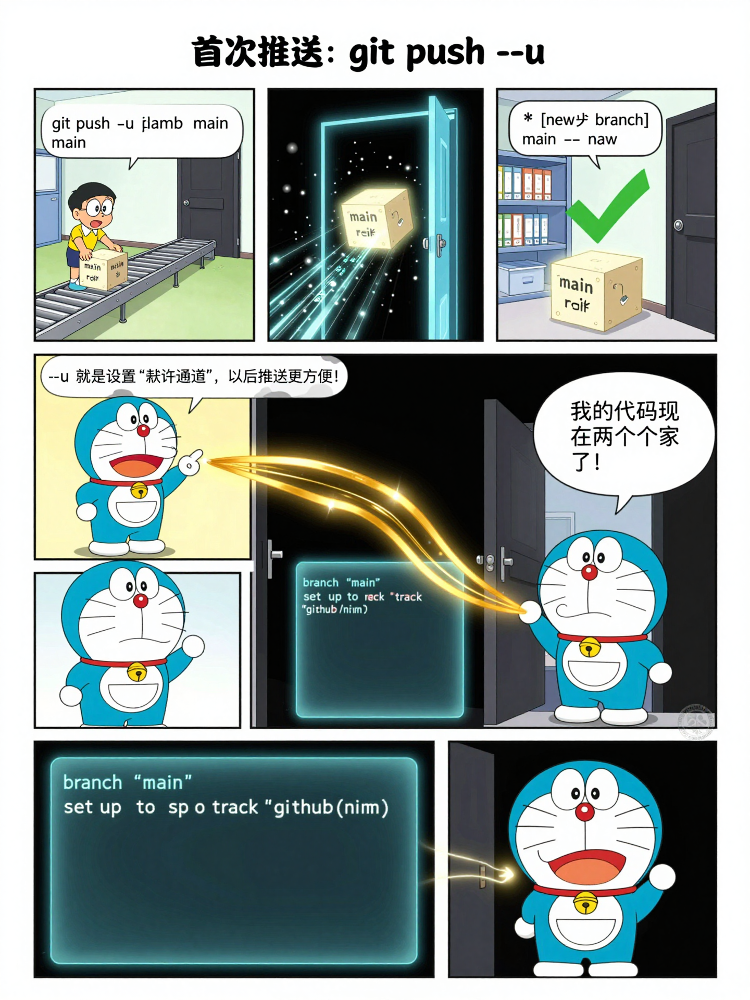
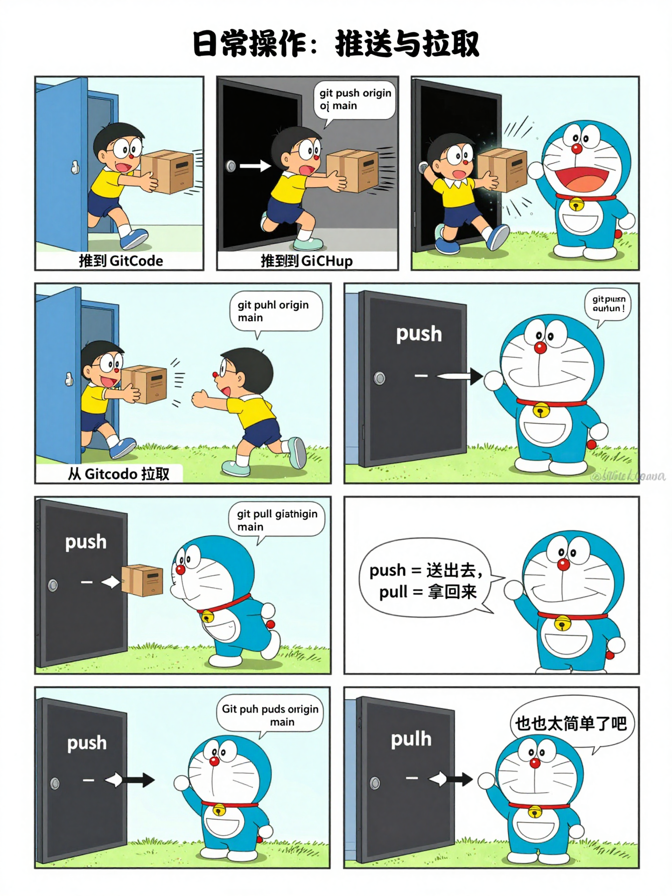

# Cursor Tutorial

交互式 Cursor IDE 快速入门网站，帮助开发者通过可视化安装指南、模拟代码编辑器和项目式学习路径快速掌握 Cursor 的核心功能。

## Git 双仓库推送 - 知识漫画

用哆啦A梦风格的漫画讲解 Git 双远程仓库配置, 从 "任意门" 隐喻理解 remote 概念。

|                                                                 |                                                             |
| :-------------------------------------------------------------: | :---------------------------------------------------------: |
|      |     |
|  |  |
|        |     |
|               |                                                             |

## 功能

- 可视化安装指南（支持 Windows / macOS / Linux）
- 模拟代码编辑器，支持 Tab、Ctrl+K、Ctrl+L、@-mentions 命令练习
- .cursorrules 文件生成器
- 项目式学习路径（Todo App 实战）

## 技术栈

- React 19 + TypeScript
- Vite
- Tailwind CSS
- Framer Motion
- React Router DOM

## 开发

```powershell
# 安装依赖
npm install

# 启动开发服务器
npm run dev

# 生产构建
npm run build

# 代码检查
npm run lint

# 运行测试
npm run test
```

## 项目结构

```
src/
├── components/     # UI 组件
│   ├── common/     # 通用组件 (Button, Card, ProgressBar)
│   ├── layout/     # 布局组件 (Header, Sidebar)
│   ├── tutorial/   # 教程组件
│   ├── simulator/  # 代码模拟器
│   └── rules/      # 规则生成器
├── contexts/       # React Context
├── hooks/          # 自定义 Hooks
├── pages/          # 路由页面
├── services/       # 业务逻辑
├── types/          # TypeScript 类型
├── data/           # 静态数据
└── utils/          # 工具函数
```

## skill 测试案例

Case 1: 登录页面

不用 skill 的提示词:
帮我生成一个登录页面, 包含用户名、密码输入框和登录按钮, 使用 React + Tailwind CSS

用 skill 的提示词:
/frontend-design 生成一个现代风格的登录页面, 包含用户名、密码输入框和登录按钮, 使用 React + Tailwind CSS, 要求有品牌感和专业的视觉层次

截图要点: 对比代码结构复杂度、视觉效果、配色方案、动画细节

Case 2: 数据仪表盘

不用 skill 的提示词:
帮我生成一个数据仪表盘页面, 包含 4 个统计卡片、一个折线图区域和一个数据表格, 使用 React + Tailwind CSS

用 skill 的提示词:
/frontend-design 生成一个专业的数据仪表盘页面, 包含 4 个统计卡片、一个折线图区域和一个数据表格, 使用 React + Tailwind CSS, 要求有清晰的信息层级和数据可视化最佳实践

截图要点: 对比布局合理性、卡片设计、间距节奏、整体专业度

Case 3: 产品定价页面

不用 skill 的提示词:
帮我生成一个 SaaS 产品定价页面, 包含 3 个定价方案 (基础/专业/企业), 使用 React + Tailwind CSS

用 skill 的提示词:
/frontend-design 生成一个高转化率的 SaaS 产品定价页面, 包含 3 个定价方案 (基础/专业/企业), 使用 React + Tailwind CSS, 要求突出推荐方案、有清晰的功能对比和 CTA 按钮设计
